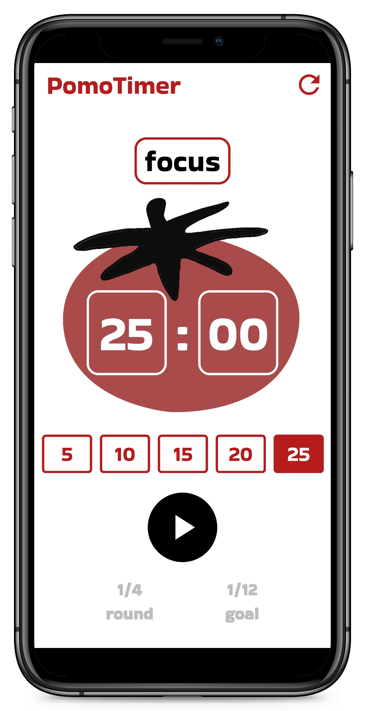

# 🍅 PomodoroTimerApp

A sleek, minimalist Pomodoro timer built with Flutter, designed to enhance productivity through structured focus and break intervals.

---

## ✨ Features

- Dynamic session transitions: **Focus**, **Short Break**, **Long Break**
- Real-time countdown with visual progress indicators
- Customizable session durations
- Auditory cues signaling session changes
- State management using the `Provider` package
- Responsive design compatible with multiple platforms

---

## 🧱 Architecture Overview

The application follows a modular structure, separating concerns into distinct components:

- **State Management**: Handled by `TimerService` using the Provider package
- **UI Components**: Custom widgets for timer display, controls, and session options
- **Utilities**: Helper functions for styling and formatting

---

## 📦 Provider Integration

State management is centralized in the `TimerService` class, which extends `ChangeNotifier`. This service manages the timer's state, including the current session type, duration, and progression.

### Key Responsibilities

- Starting, pausing, and resetting the timer
- Transitioning between sessions
- Notifying listeners of state changes

### Usage Example

```dart
final timerService = Provider.of<TimerService>(context);
```

## 📂 Class Breakdown

### `TimerService`
Manages the core logic of the Pomodoro timer, including session transitions and timer countdowns.

**Key Methods:**

- `start()` – Initiates the countdown timer.  
- `pause()` – Pauses the timer.  
- `handleNextRound()` – Transitions between sessions and resets durations accordingly.  
- `selectTime(double seconds)` – Sets a custom duration for sessions.  

---

### `PomodoroScreen`
The main screen displaying the timer, session type, and controls.

## Screenshot

| Application Screen |
|--------------------|
|  |

**Components:**

- **AppBar** – Displays the app title and a refresh button.  
- **Session Indicator** – Shows the current session type (Focus, Break, Long Break).  
- **Timer Display** – Visual representation of the countdown.  
- **Controls** – Start, pause, and reset buttons.  
- **Progress Indicator** – Visualizes completed sessions.  

---

### `TimerCard`
Displays the current countdown timer in a stylized card.

---

### `TimeController`
Provides control buttons to start, pause, and reset the timer.

---

### `TimeOptions`
Allows users to select different session durations.

---

### `ProgressWidget`
Visualizes the user's progress through the Pomodoro cycles.

---

## 🎨 Styling and Theming

The application utilizes a consistent color scheme:

- `Colors.red[900]` (0xFFB71C1C)  
- Black  
- White  

Dynamic background colors can be implemented to enhance visual appeal and indicate different sessions.

---

## 🔊 Audio Integration

Auditory cues are provided using the `audioplayers` package. A sound is played at the end of each session to signal the transition.

**Implementation:**

```dart
final player = AudioPlayer();
await player.play(AssetSource("ping.mp3"));

## 🚀 Getting Started

**Clone the repository:**

```bash
git clone https://github.com/JayWoodroffe/PomodoroTimerApp.git

**Navigate to the project directory:**

```bash
cd PomodoroTimerApp

**Install dependencies:**

```bash
flutter pub get

**Run the app:**

```bash
flutter run

---

## 🧪 Testing

To run tests, use the following command:

```bash
flutter test
```

---

